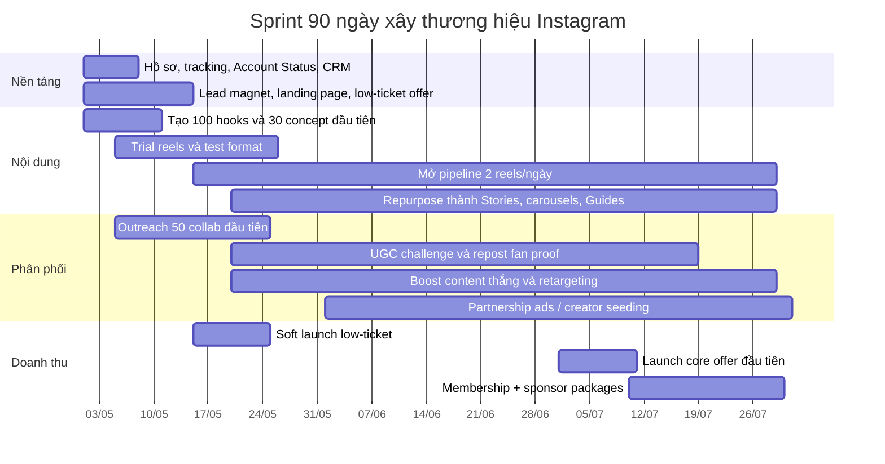

# Khối 6 — Chiến lược Instagram đạt 1M follow

> Nguồn: thầy [[Phạm Thành Long]], khoá [[index|IPS]]. File gốc .docx — 247 dòng nội dung.

## TL;DR

Bản chiến lược xây tài khoản Instagram lên **1 triệu follower trong 90 ngày**, hướng đến **doanh thu triệu đô năm 2026**. Mục tiêu 1M/90 ngày là **outlier** — không đạt bằng "đăng đều", mà bằng cỗ máy Reels nguyên bản + collab + paid amplification đúng chỗ. Triết lý cốt lõi: **xây doanh thu song song với tăng follower**, không đợi đủ follower mới kiếm tiền. Định vị khuyến nghị: **[[Hybrid Transformation Brand]]** — chuyên môn thật + cá tính thật + hành trình biến đổi rõ ràng. Công thức tăng trưởng: `Lượt theo dõi mới = Lượt xem từ non-followers × Tỷ lệ đổi từ view sang follow`.

## Mục đích trong IPS

- Xây tài sản kênh Instagram đủ lớn (1M follower) làm đòn bẩy phân phối cho TPCN.
- Cung cấp framework vận hành cỗ máy nội dung, lịch sản xuất, chiến lược collab và ads.
- Kết nối Instagram với CRM, lead funnel, [[Revenue Stack]] → biến follower thành khách trả tiền.
- Bổ sung kênh phân phối song song Facebook (Khối 4) và TikTok (Khối 5).

## Giả định và tính khả thi

> Nhiều biến số chưa xác định — kế hoạch dùng giả định hợp lý để dựng thực thi. Cần update khi có thông tin thực tế.

| Biến số | Trạng thái | Giả định dùng cho kế hoạch |
|---|---|---|
| Ngành / ngách | Chưa xác định | Dùng mô hình creator-commerce — bán kiến thức, cộng đồng, sản phẩm, bundle |
| Điểm xuất phát tài khoản | Chưa xác định | Tài khoản chưa có distribution mạnh; tối ưu để scale từ nhỏ |
| Thị trường chính | Chưa xác định | Ưu tiên song ngữ Việt–Anh để mở trần reach |
| Ngân sách | Chưa xác định | Khuyến nghị kịch bản trung; vẫn trình bày thấp/trung/bự |
| Sản phẩm hiện có | Chưa xác định | Phải có 1 low-ticket trong 14 ngày đầu; 1 core offer trong 45 ngày đầu |
| Đội ngũ | Chưa xác định | Tối thiểu: 1 chiến lược + 1 quay/chụp + 1 editor + 1 vận hành cộng đồng + 1 funnel |

## Triết lý nền tảng

- **1M/90 ngày là bài toán phân phối, không phải bài toán nội dung đẹp.** Phải tạo được lượng xem lớn từ người chưa theo dõi → chuyển thành follower → chuyển thành người để lại thông tin → người mua → người mua lặp lại.
- **Follower KHÔNG đồng nghĩa với tiền.** Subscriptions, Gifts, Branded Content đều performance-based — cần mô hình kiếm tiền rõ từ đầu.
- **Mối nguy lớn nhất**: xây tài khoản lớn bằng content phổ thông, rồi cố bán SP không liên quan → follower tăng nhưng doanh thu không tăng.
- **Reels là đường vào lớn nhất** với non-followers; carousel tạo authority và saves; Stories và Live chuyển hóa và xây niềm tin.
- **Định vị hybrid transformation**: thương hiệu vừa dạy, vừa giải trí, vừa cho thấy hành trình biến đổi thật — khớp mạnh với tệp 18–34 tuổi chiếm tỷ trọng lớn nhất IG.

## KPI cần nắm

| KPI | Mục tiêu / Benchmark |
|---|---|
| Follower mục tiêu | 1.000.000 / 90 ngày (outlier target) |
| Mục tiêu doanh thu kế hoạch | ~2,2 triệu USD (phần còn lại năm 2026, nếu đạt 1M follow) |
| Người dùng IG VN trong tệp quảng cáo | ~11,7 triệu (cuối 2025) |
| Người dùng IG toàn cầu trong tệp quảng cáo | 1,74 tỷ (tháng 1/2025) |
| Nhóm tuổi lớn nhất | 25–34, tiếp theo 18–24 |
| Reels dài tối đa được đề xuất | 3 phút (từ tháng 1/2025) |
| Tần suất đăng sprint | 2+ Reels/ngày (sprint 90 ngày) |
| Tần suất đăng bền vững | 3–5 bài/tuần |
| Sweet spot giờ đăng | Thứ Ba–Tư, 12h–21h (theo múi giờ khán giả) |
| CPM IG ads (định hướng) | ~2–6 USD / 1.000 impressions (2026) |
| CPC IG ads (định hướng) | ~0,40–2,00 USD / click (2026) |
| CVR ecommerce benchmark | 1,6%–2,9% (phổ biến 2%–3%) |
| Email đóng góp doanh thu | ~27% doanh thu cửa hàng (benchmark) |
| Trial Reels: creator đăng thường xuyên hơn | 40% sau khi dùng Trial Reels |
| Trial Reels: reach từ non-followers tăng | 80% trong số creator dùng Trial Reels |

### KPI theo phễu (chi tiết vận hành)

| Tầng phễu | KPI | Ngưỡng vận hành |
|---|---|---|
| **Discovery** | Non-follower reach | Tăng liên tục theo tuần |
| **Discovery** | Follow per 1.000 views | <5 là yếu; 5–10 chấp nhận; >10 là mạnh |
| **Discovery** | Shares per 1.000 views | >7 là tốt cho Reels mở reach |
| **Discovery** | Average watch time | Reel ngắn phải giữ được phần lớn người xem qua phần đầu |
| **Consideration** | Profile visit rate | Tối thiểu 1% từ nội dung top-performing |
| **Consideration** | Story link click / reply rate | Tăng đều trước mỗi launch |
| **Conversion** | Landing page opt-in rate | 20–35% |
| **Conversion** | Store / offer CVR | 2–3% là baseline tốt; >3% là rất khỏe |
| **Retention** | Repeat purchase rate | Tăng theo quý |
| **Retention** | Membership churn | Mục tiêu <8%/tháng |
| **Monetization** | AOV | Tăng bằng bundle/upsell |
| **Efficiency** | CAC / ROAS | Chỉ scale ads khi unit economics lành mạnh |

### Bảng tỷ lệ view-to-follow (tính ngược)

| Tỷ lệ follow / view | Non-followers cần | Bình quân/ngày | Nếu 20% là "reel thắng lớn" |
|---|---|---|---|
| 0,5% | 200.000.000 | 2.222.222 | 5.555.556 view/reel thắng |
| 0,8% | 125.000.000 | 1.388.889 | 3.472.222 view/reel thắng |
| 1,2% | 83.333.333 | 925.926 | 2.314.815 view/reel thắng |
| 2,0% | 50.000.000 | 555.556 | 1.388.889 view/reel thắng |

> Giả định 180 Reels trong 90 ngày, 20% là "reel thắng lớn" = 36 Reels viral.

## Chiến lược tổng thể Instagram

### Định vị thương hiệu

Bốn lựa chọn kiến trúc thương hiệu khả thi trên Instagram (đánh giá cho mục tiêu 1M/90d):

| Lựa chọn | Khả năng viral | Khả năng kiếm tiền | Đánh giá cho 1M/90d |
|---|---|---|---|
| Ngách chuyên môn sâu | Thấp–trung bình | Rất cao | Khó — trần reach hẹp |
| Lifestyle / entertainment rộng | Rất cao | Trung bình | Có thể — dễ reach nhưng khó đổi thành tiền |
| **Hybrid transformation** | **Cao** | **Cao** | **Tối ưu nhất** |
| B2B chuyên nghiệp | Thấp | Rất cao/follower | Không phù hợp cho 1M/90d |

**[[Hybrid Transformation Brand]]** = kết hợp ba việc cùng lúc:
- Cho người xem thấy **kết quả đáng muốn**
- Cho họ thấy **hệ thống đạt kết quả đó**
- Cho họ thấy **con người đứng sau hệ thống đáng tin**

Công thức định vị:
> "Tôi giúp [đối tượng] đạt [kết quả] nhanh hơn mà không [nỗi đau chính], bằng [phương pháp độc quyền hoặc khác biệt]."

### Kiến trúc tăng trưởng

| Lớp | Nội dung |
|---|---|
| **Discoverability** | [[Instagram SEO]] + Trial Reels + Reels native reach → mở rộng non-follower |
| **Conversion to follow** | Hook mạnh, series, collab, UGC → chuyển người xem thành follower |
| **Community depth** | Stories, Live, Q&A, UGC challenge → giữ cộng đồng |
| **Monetization** | [[Offer Ladder]] — lead magnet → low-ticket → core offer → membership → sponsor |

### Ba lớp chiến lược cốt lõi

1. **Tăng trưởng hữu cơ**: [[Instagram SEO]] + [[Trial Reels]] + hook viral + collabs + UGC
2. **Phân phối trả phí**: boost content thắng + retargeting + [[Partnership Ads & Whitelisted Creator]]
3. **Kiếm tiền đa lớp**: [[Revenue Stack]] — Subscriptions, Gifts, Branded Content, Ecommerce, Sponsor

## Quy trình chi tiết theo tuần/tháng — Sprint 90 ngày

### Giai đoạn 1: Nền tảng (Ngày 1–7)

- Setup professional account, bật monetization readiness từ sớm
- Tối ưu bio theo [[Instagram SEO]]: tên hiển thị, username, bio chứa từ khóa khách hàng tìm
- Thiết lập Account Status — kiểm tra eligibility cho recommendation định kỳ
- Kết nối CRM (Google Sheet + Manychat khởi đầu OK)
- Dựng lead magnet, landing page, low-ticket offer
- Tạo 100 hooks và 30 concept đầu tiên
- Setup link stack (Linktree hoặc tương đương) trong bio

### Giai đoạn 2: Test format (Ngày 5–25)

- Chạy **[[Trial Reels]]** để test ý tưởng với non-followers trước khi publish chính thức
- Đăng 14 Reels đầu tiên với hook đa dạng
- Đo watch time, retention, shares, likes sau mỗi reel
- Sau 24h: xem chỉ số Trial Reels, quyết định publish hay không
- Chốt 2–3 format/series thắng (hold rate + follow rate vượt baseline)
- Outreach 50 collab đầu tiên (cùng ngách, audience overlap)

### Giai đoạn 3: Scale nội dung (Ngày 15–90)

- Mở pipeline 2+ Reels/ngày liên tục
- Repurpose: 1 Reels → Stories + Carousel + Guide
- Chạy UGC challenge hằng tuần — repost proof từ fan
- Scale collab: co-author post, Remix, paid partnership
- Boost content thắng bằng paid ads, retarget người đã xem/chạm

### Giai đoạn 4: Doanh thu song song (Từ Ngày 15)

- Soft launch low-ticket offer (tuần 3)
- Launch core offer đầu tiên (tháng 2)
- Mở Membership + sponsor packages (tháng 2–3)
- Đo CPL, qualified lead rate, CPA — điều chỉnh funnel

### Mốc kiểm tra 30/60/90 ngày

| Ngày | Mục tiêu | Việc phải xảy ra | Chỉ báo đúng hướng |
|---|---|---|---|
| **1–30** | Tìm format thắng | Test 30 concept; chốt 3–5 hook mạnh nhất; mở low-ticket | Có ít nhất 5 Reels vượt xa median account |
| **31–60** | Scale nội dung thắng | Tăng collab; retarget viewer; bắt đầu sponsor pipeline; Live đều | Non-follower reach tăng tuần sau cao hơn tuần trước |
| **61–90** | Tăng tốc follower + tiền | Launch core offer; bundle sponsor; membership; event teaser | Follower tăng theo "bậc thang", không còn tăng tuyến tính |

> Nếu reach tăng mà lead không tăng → đang đuổi vanity metrics, điều chỉnh ngay. Nếu sau ngày 90 chưa chạm 1M → chuyển từ "đua follower" sang "đua lợi nhuận".

### Lịch đăng khuyến nghị (baseline)

| Thứ | Khung giờ tốt | Ghi chú |
|---|---|---|
| Thứ Hai | 14–16h | Baseline |
| Thứ Ba | 13–19h | Mạnh nhất |
| Thứ Tư | 12–21h | Mạnh nhất |
| Thứ Năm | 12–14h | Trung bình |
| Cuối tuần | Thấp hơn | Điều chỉnh theo Insights sau 14 ngày |

> Sau 14 ngày đầu: thay baseline bằng dữ liệu riêng từ Instagram Insights.

## Format Mix Instagram

| Format | Chức năng chính | Tần suất khuyến nghị |
|---|---|---|
| **Reels (gốc, 9:16)** | Kéo reach từ non-followers | 2+ mỗi ngày (sprint), 3–5/tuần (duy trì) |
| **Carousel Post** | Tạo authority, tăng saves, giải thích sâu | 2–3/tuần |
| **Stories** | Chuyển hóa, tương tác cộng đồng, CTA DM | Gần như hằng ngày |
| **Live** | Xây niềm tin, chốt offer, Q&A | 1–2/tuần |
| **Guides** | Gom kiến thức evergreen, SEO nội tại | 1–2/tháng |
| **Reels collab / Remix** | Mượn tệp audience từ creator khác | 3–7 tài sản/tuần |

**Logic phân bổ:**
- Reels kéo người lạ vào cửa
- Carousel khiến họ tin bạn đáng theo dõi
- Stories và Live khiến họ mua

**6 trụ cột nội dung cố định 90 ngày (với tỷ trọng gợi ý):**

| Trụ cột | Mục tiêu | Tỷ trọng |
|---|---|---|
| Pain destruction | Đập nỗi đau và hiểu lầm phổ biến | 25% |
| Process / BTS | Hậu trường, quy trình, before/after | 20% |
| Proof | Kết quả, case, reaction, testimonial | 20% |
| Personality | Quan điểm, câu chuyện, chuẩn nghề, góc nhìn riêng | 15% |
| Teaching | Checklist, framework, mini lesson | 15% |
| Offer | CTA vào DM, link, live, lead magnet, sản phẩm | 5% |

**Format mix với KPI theo từng loại:**

| Định dạng | Vai trò chính | Nên dùng khi nào | KPI chính |
|---|---|---|---|
| Reels | Khám phá người mới | Hằng ngày, là định dạng chủ lực | Non-follower reach, watch time, follow/view |
| Stories | Nuôi quan hệ và chốt hành động | Hằng ngày (8–15 frames) | Link click, reply, sticker taps |
| Live | Tăng trust, mở bán, xử lý objection | 1–3 lần/tuần | Peak viewers, comments, DMs sau live |
| Carousel posts | Tạo saves, shares, authority | 2–4 bài/tuần | Saves, shares, profile visits |
| Static posts | Social proof, aesthetics, announce | 0–1 bài/tuần | Reach, comment quality |
| Guides | Gom bài evergreen, FAQ, library | 1 bài/tuần | Profile retention, time on profile |

**Nhịp đăng chi tiết theo sprint:**

| Định dạng | Tần suất |
|---|---|
| Reels | 2 Reels/ngày trong 30 ngày đầu; 2–3 Reels/ngày từ ngày 31 nếu pipeline đủ khỏe |
| Stories | 8–15 frames/ngày |
| Carousel posts | 3 bài/tuần |
| Live | 2 lần/tuần; tăng thành 3 lần/tuần trong tuần launch |
| Guides | 1 guide/tuần, gom các bài hiệu suất tốt |
| Comment pin + DM CTA | Mọi bài quan trọng |

## Cấu trúc nội dung: Hook — Body — CTA

### Hook (giây 0–3): quyết định toàn bộ

**5 kiểu hook xác suất thắng cao trên IG:**
1. **Hook kết quả trước**: "Sau 90 ngày, kết quả trông như thế này…"
2. **Hook sai lầm**: "95% người đang cố 1M follower theo cách sai…"
3. **Hook đối lập / pattern interrupt**: "Đừng đăng nhiều hơn. Đăng thông minh hơn."
4. **Hook danh tính**: "Nếu bạn đang bán TPCN mà chưa biết điều này…"
5. **Hook mở vòng lặp**: "Thứ cuối cùng trong danh sách này mới là thứ phá game nhất."

**Script Reels giáo dục 20–30 giây:**
- 0–2s: Hook kết quả ngược hoặc sai lầm phổ biến
- 2–6s: Nêu 3 điểm cốt lõi sẽ trình bày
- 6–16s: 3 ý ngắn, on-screen text rõ ràng
- 16–22s: Chèn proof hoặc dashboard screen
- 22–28s: CTA: "Comment từ khóa [X] để tôi gửi [Y]"

**Script Reels before/after:**
- 0–2s: "Bài này trước đây chết reach. Đây là cách tôi cứu nó."
- 2–8s: Mở ảnh/clip trước
- 8–16s: 3 thay đổi: hook, pacing, CTA
- 16–24s: Ảnh sau và số liệu cụ thể
- 24–30s: "Lưu lại để sửa bài tiếp theo của bạn."

**Script Reels cá tính + niềm tin:**
- 0–3s: Tuyên bố đối lập với niềm tin phổ biến
- 3–10s: Nguyên tắc cốt lõi của mình
- 10–20s: Mini-story thật (30 giây đủ)
- 20–27s: Chốt nguyên tắc
- 27–30s: CTA comment hoặc follow vì loạt tiếp theo

### Body
- On-screen text rõ, đọc được khi tắt tiếng
- Pacing nhanh, không lãng phí giây nào
- Proof / số liệu / dashboard screen = tăng authority

### Caption
- **125 ký tự đầu** phải kéo người đọc tiếp (phần không bị cắt trong feed)
- Caption authority: liệt kê 3–5 điều thực dụng, không văn vẻ
- Caption kéo DM: "Comment từ khóa [X] — tôi gửi trong DM"
- Caption bán offer: nêu đối tượng đúng + lợi ích thật + link bio
- Không chôn CTA ở cuối caption — đặt sớm

### CTA
- DM keyword (dùng Manychat automation)
- Comment keyword
- Link bio (link stack)
- Follow vì loạt tiếp theo

## Cách tăng Reach + Engagement

### 5 đòn bẩy tăng trưởng hữu cơ

1. **[[Instagram SEO]]** — caption chứa từ khóa thật, bio chuẩn, hashtag relevant trong caption (không trong comment)
2. **[[Trial Reels]]** — test với non-followers trước, chỉ publish Reels đã có tín hiệu thắng
3. **Hook viral** — đa dạng hook, đo hold rate, nhân bản hook thắng
4. **Collabs** — mời tối đa 3 co-author/post; dùng Remix; paid partnership
5. **[[UGC Challenge Strategy]]** — tạo "challenge" hoặc "proof ritual" hằng tuần, repost có chọn lọc lên Stories/Highlights/Carousel

### Hashtag Mix

- Hashtag relevant + đang thịnh hành **trong cùng chủ đề** → giúp chạm thêm người mới
- Đặt hashtag trong **caption**, không trong comment (Instagram khuyến nghị chính thức)
- Không spam hashtag không liên quan — bị IG giảm reach

### Alt Text

- Thêm alt text mô tả nội dung ảnh/video → hỗ trợ Instagram SEO nội tại
- Dùng ngôn ngữ khách hàng tìm, không dùng từ kỹ thuật

### Caption đầu 125 ký tự

- Là phần duy nhất hiển thị trong feed trước khi người xem bấm "Xem thêm"
- Phải chứa hook hoặc lời hứa giá trị rõ ràng
- Không bắt đầu bằng hashtag, không bắt đầu bằng @mention

### Tín hiệu thuật toán IG cần biết (2024–2026)

| Tín hiệu cốt lõi | Ý nghĩa vận hành |
|---|---|
| **Watch time** (tổng thời gian xem) | Reels dài hơn xem xong = tín hiệu mạnh nhất |
| **Retention** (giữ người xem) | Đo 50% retention rate — nếu thấp, sửa hook + pacing |
| **Shares** (lượt chia sẻ) | Tín hiệu lan truyền mạnh nhất — thiết kế content để share |
| **Likes** | Tín hiệu cơ bản |
| **Eligibility** | Kiểm tra Account Status định kỳ — nội dung vi phạm bị suppress recommendation |
| **Originality** | IG siết mạnh từ 2024–2026, mở rộng sang ảnh/carousel từ 30/4/2026 |

**IG đang phạt (TRÁNH TUYỆT ĐỐI):**
- Repost rõ rệt (nội dung tái chế lộ liễu / "visibly recycled")
- Nội dung có watermark nền tảng khác
- Tài khoản kiểu aggregator (chỉ tổng hợp content người khác)
- Post quá nhiều nội dung sao chép
- Hứa hẹn kết quả y tế không có căn cứ

## Instagram SEO để lên top tìm kiếm

> Instagram Search ngày càng giống Google — đối sánh username, bio, caption, hashtag và location.

**5 điểm tối ưu bắt buộc:**

1. **Username** — chứa từ khóa ngành hoặc tên thương hiệu rõ ràng
2. **Tên hiển thị** — 1–2 từ khóa chính người dùng tìm (vd: "TPCN | Sức khoẻ" thay vì chỉ tên)
3. **Bio** — không viết văn vẻ; chứa đúng ngôn ngữ khách hàng dùng để tìm vấn đề của họ; có lời hứa rõ + CTA + link
4. **Caption** — từ khóa thật trong caption (không phải comment); hashtag đúng chủ đề, còn thịnh hành
5. **Alt text** — mô tả nội dung ảnh/video bằng từ khóa tự nhiên

**Khung hồ sơ đề xuất (bio template):**
```
[Từ khóa kết quả chính]
[Đối tượng phục vụ] | [Phương pháp độc quyền]
[Social proof ngắn: số liệu thật / thành tựu]
↓ [CTA + link]
```

**Chi tiết từng thành phần hồ sơ:**

| Thành phần | Mẫu triển khai |
|---|---|
| Tên hiển thị | [Kết quả] cho [đối tượng] |
| Ảnh đại diện | Cận mặt rõ, tương phản cao, nhận diện ổn định |
| Bio dòng 1 | Tôi giúp [đối tượng] đạt [kết quả] |
| Bio dòng 2 | Proof: số khách hàng / kết quả / kinh nghiệm |
| Bio dòng 3 | CTA: "Nhận checklist miễn phí ở link" |
| Highlights | Start Here / Results / FAQ / Offer / Proof / Behind the scenes |

**Lưu ý**: kiểm tra Account Status định kỳ để đảm bảo tài khoản eligible (đủ điều kiện được recommend). Nếu tài khoản bị flag, nội dung tốt cũng không được đề xuất.

## Funnel IG → Đơn hàng

```
Reels native reach (non-followers)
  → Watch time cao → Recommendation mở rộng
    → Follow + Saves
      → Stories + Live + Q&A → Niềm tin
        → DM keyword → Manychat automation
          → Lead magnet (miễn phí)
            → CRM / email / SMS / DM sequence
              → Low-ticket offer → Core offer
                → Membership / Subscription
                  → Sponsor / Brand deal
                    → [[Offer Ladder]] toàn bộ stack
```

### Tháp sản phẩm (Offer Ladder IG)

| Bậc | Offer gợi ý | Giá tham khảo | Mục tiêu |
|---|---|---|---|
| **Free** | Checklist, script, quiz, audit mini | 0 USD | Thu lead |
| **Low-ticket** | Template, mini-kit, starter bundle, mini-course | 19–59 USD | Kiểm tra willingness to pay |
| **Core offer** | Khóa học, hệ thống, toolkit đầy đủ | 149–499 USD | Doanh thu chính |
| **Recurring** | Membership / subscription | 9–29 USD/tháng | Dòng tiền lặp lại |
| **Premium** | Cohort, workshop, consulting group, event | 499–2.000 USD+ | Lợi nhuận cao, authority cao |

> Creator vận hành tốt ở Đông Nam Á có thể đạt 10.000 USD/tháng trở lên từ subscription. Subscription chỉ hiệu quả nếu nội dung trả phí **khác hẳn** nội dung miễn phí.

### Mô hình kiếm tiền đa nguồn

| Nguồn | Chức năng trong stack |
|---|---|
| **Subscriptions (thuê bao IG)** | Dòng tiền lặp lại từ fan trung thành |
| **Gifts (quà tặng Live)** | Tăng thu nhập từ buổi Live |
| **Branded Content / Partnership Ads** | Đòn bẩy audience creator khi collab |
| **Ecommerce (TPCN)** | Doanh thu chính từ sản phẩm |
| **Lead Gen → Sales** | Funnel offline/telesales cho ticket cao |
| **Sponsorship** | Doanh thu lớn sau khi kênh có authority |
| **Cohort / Event** | Biên lợi nhuận cao nhất |

**Giả định cho mô hình dự báo:**

| Biến số | Giả định |
|---|---|
| Ngày bắt đầu | 1/5/2026 |
| Mốc follower | 100K cuối T5; 350K cuối T6; 1M cuối T7; 1,35M cuối T12 |
| Low-ticket | AOV 59 USD; 0,18% follower/tháng mua |
| Core offer | 349 USD; launch tháng 7, 9, 11 |
| Membership | 12 USD/tháng; 7.500 thành viên hoạt động cuối T12 |
| Premium workshop | 699 USD; chạy tháng 10 và 12 |
| Affiliate | ~15% doanh thu low-ticket |

**Dự báo doanh thu kế hoạch 2026** (giả định đạt 1M follow):

| Tháng | Doanh thu kế hoạch (USD) | Driver chính |
|---|---|---|
| T5 | 13.413 | Soft launch + low-ticket |
| T6 | 46.346 | Low-ticket + lead generation |
| T7 | 287.280 | Launch core offer đầu tiên + sponsor đầu tiên |
| T8 | 193.236 | Membership ramp + sponsor |
| T9 | 360.943 | Launch core offer thứ hai |
| T10 | 333.393 | Workshop premium + sponsor |
| T11 | 476.934 | Launch core offer thứ ba + sponsor lớn |
| T12 | 520.696 | Workshop + sponsor bundle + mùa mua sắm cuối năm |
| **Tổng 2026** | **2.232.241** | Mô hình cơ sở |

**Ba kịch bản:**

| Kịch bản | Kết quả follower 90 ngày | Doanh thu 2026 |
|---|---|---|
| Thấp | 100K–250K | 300K–900K USD |
| Cơ sở | 1M | ~2,2M USD |
| Cao | 1,2M+ và offer khỏe | 3M+ USD |

> Đây là mô hình kế hoạch, không phải bảo đảm xác suất. Nếu sau ngày 30 chỉ số đầu phễu không đạt → chuyển từ "đua follower" sang "đua lợi nhuận".

## Frameworks / Công thức cụ thể

### Công thức tính lượng view cần thiết

```
Lượt theo dõi mới = Lượt xem từ non-followers × Tỷ lệ đổi từ view sang follow
Mục tiêu: 1.000.000 / 90 ngày
→ Nếu follow rate = 5%: cần 20.000.000 lượt xem từ non-followers
→ Nếu follow rate = 2%: cần 50.000.000 lượt xem từ non-followers
```

**Kết luận**: 1M/90d là bài toán "đăng rất nhiều nội dung có khả năng thắng lớn, rồi khuếch đại cái đang thắng" — không phải bài toán "đăng đều".

### Quy tắc Trial Reels

- Đăng Trial Reel → chờ 24h → xem chỉ số
- Nếu tín hiệu tốt → publish chính thức + boost
- Nếu tín hiệu yếu → không publish, thử hook/format khác
- 40% creator đăng thường xuyên hơn sau Trial Reels; 80% thấy reach từ non-followers tăng

### Ba tầng mục tiêu (thay vì chỉ "1M")

| Tầng | Mục tiêu | Ý nghĩa quản trị |
|---|---|---|
| **Stretch goal** | 1 triệu follower trong 90 ngày | Mục tiêu kéo cả hệ thống chạy ở tốc độ cao |
| **Operating target** | 300.000–600.000 follower chất lượng trong 90 ngày | Mốc thực tế hơn nếu nội dung không tạo breakout cực mạnh |
| **Floor goal** | 100.000 follower chất lượng + hệ thống kiếm tiền lời | Nếu không chạm được tầng này, chiến dịch cần xem lại chiến lược |

### Công thức kiểm tra economic engine

```
"traffic × conversion × giá trị đơn hàng TPCN"
HOẶC
"lead × close rate × ticket"
```

Không viết được công thức này → kênh lớn nhưng chưa chắc có tiền.

### Công thức A/B test (chỉ test biến ảnh hưởng trực tiếp)

| Biến test | Quy tắc ra quyết định |
|---|---|
| Hook mở đầu (giây 0–3) | Giữ hook có hold rate cao hơn baseline ≥20% |
| Độ dài Reels | Reach → ~1 phút; view quality + follow → 90–120s |
| Caption độ dài | Đo engagement rate thực tế, không đoán |
| CTA loại | Giữ CTA có tỷ lệ hành động cao nhất theo mục tiêu |
| Giờ đăng | Giữ khung giờ có velocity cao nhất trong 60 phút đầu |

## Số liệu, Case Study, Ví dụ kênh

### Case study tăng trưởng creator (từ Instagram)

| Case | Kết quả | Đòn bẩy vận hành |
|---|---|---|
| Creator ngành tổng quát | Tăng follower 6 lần / 12 tháng | 260 Reels / 12 tháng (~5 Reels/tuần) + Stories hằng ngày |
| Creator dùng Trial Reel | ~60.000 follower từ 1 trial reel | Trial Reel hit → publish + compound |
| Creator năng động | ~100.000 follower / 6 tháng | Hệ thống đăng đều + collab |
| Creator ngành ẩm thực | Tăng 180% lên 7 triệu follower / 12 tháng | Chiến lược Reels toàn diện |

> Điểm chung: tăng trưởng nhanh đến từ **hệ thống**, không đến từ may mắn đơn lẻ.

### Benchmark chi phí creator (2025)

| Tier | Follower | Chi phí / post IG |
|---|---|---|
| Nano | <10K | $500–$2.000 |
| Micro | 10K–100K | $2.000–$8.000 |
| Mid-tier | 100K–500K | $8.000–$20.000 |
| Macro | 500K–1M | $20.000–$45.000 |
| Mega | 1M+ | $45.000+ |

> Ngân sách nhỏ → đánh vào số lượng collab nhỏ đúng tệp, không săn vài gương mặt lớn.

### Kịch bản ngân sách (90 ngày)

| Kịch bản | Tổng ngân sách 90 ngày | Dùng cho ai | Khả năng đạt 1M/90d |
|---|---|---|---|
| **Thấp** | 5.000–15.000 USD | Brand tự vận hành, mới test signal | Không đủ để nhắm nghiêm túc; chỉ đủ validate |
| **Trung** | 25.000–75.000 USD | Lựa chọn tối ưu nhất | Có cơ hội, nếu content breakout và offer ổn |
| **Bự** | 150.000–500.000+ USD | Brand có LTV cao, back-end mạnh | Có cửa thật, nhưng chỉ nếu creative đủ mạnh |

### Phân bổ ngân sách theo hạng mục

| Hạng mục | Kịch bản Thấp | Kịch bản Trung | Kịch bản Bự |
|---|---|---|---|
| Khuếch đại organic winners | 60% | 50% | 40% |
| Retargeting | 20% | 20% | 15% |
| Creator seeding / collab phí mềm | 10% | 20% | 20% |
| Partnership ads / whitelisting | 0% | 5% | 15% |
| Test creative mới | 10% | 5% | 5% |
| Hạ tầng sản xuất | ngoài media | ngoài media | ngoài media |

**Lưu ý chi phí creator**: tính đủ cả creative freedom, usage rights, exclusivity, approval rounds, paid partnership label.

## Công cụ thầy khuyên dùng

| Công cụ | Chức năng |
|---|---|
| **Instagram Professional Dashboard** | Quản trị chung, monetization, earnings |
| **Instagram Insights** | Đo tăng trưởng, engagement, reach by source |
| **Instagram Account Status** | Kiểm tra eligibility cho recommendation |
| **Instagram Trial Reels** | Test nội dung với non-followers trước khi publish |
| **Instagram Collabs** | Co-author post với tối đa 3 người |
| **Instagram Paid Partnership Label** | Gắn nhãn bắt buộc cho branded content |
| **Meta Ads Manager** | Chạy và tối ưu paid amplification |
| **Manychat** | Automation DM keyword → CRM |
| **CRM** (Google Sheet khởi đầu) | Quản lý lead từ Instagram |
| **Linktree / link stack** | Link hub trong bio |
| **Sprout Social / Buffer** | Lịch đăng và phân tích benchmark |

## Lộ trình 90 ngày — Gantt chi tiết

> Giả định: dùng Trial Reels, Collabs và Partnership Ads như ba feature trụ xuyên suốt sprint. Khởi động 01/05/2026.



## Nguồn tham chiếu chính thức

Instagram thậm chí đã có một số trang hướng dẫn bằng tiếng Việt cho creators và recommendation best practices.

| Chủ đề | URL |
|---|---|
| Số liệu người dùng IG | https://datareportal.com/essential-instagram-stats |
| Brand Partnership Tips | https://creators.instagram.com/lab/brand-partnership-tips |
| Helping Creators Break Through (Reels) | https://creators.instagram.com/blog/helping-creators-of-all-sizes-break-through |
| Earn Cash Making What You Love | https://creators.instagram.com/earn-cash-making-what-you-love |
| Account Status / Eligibility | https://help.instagram.com/502981923235522 |
| Case study Jackson Olson | https://creators.instagram.com/blog/jackson-olson |
| How Instagram Search Works | https://about.instagram.com/blog/announcements/break-down-how-instagram-search-works |
| Recommendations Eligibility Tips (EN) | https://creators.instagram.com/blog/instagram-recommendations-eligibility-tips-creators |
| Best Times to Post (Sprout Social) | https://sproutsocial.com/insights/best-times-to-post-on-instagram/ |
| How Often to Post (Buffer) | https://buffer.com/resources/how-often-to-post-on-instagram/ |
| Recommendations Eligibility Tips (VI) | https://creators.instagram.com/blog/instagram-recommendations-eligibility-tips-creators?locale=vi_VN |
| Trial Reels | https://creators.instagram.com/blog/instagram-trial-reels |
| Collabs & Music | https://creators.instagram.com/blog/new-ways-to-create-with-music-and-collaborate-on-instagram |
| Boost Instagram Posts | https://business.instagram.com/boost-instagram-posts/get-started |
| Instagram Ads Cost (WordStream) | https://www.wordstream.com/blog/instagram-ads-cost |
| Subscriptions cho creators | https://creators.instagram.com/blog/bringing-subscriptions-to-more-creators-on-instagram |
| CVR ecommerce (Shopify) | https://www.shopify.com/blog/retail-conversion-rate |
| Influencer pricing (Impact) | https://impact.com/influencer/how-much-do-influencers-charge-per-post/ |
| Professional Dashboard | https://help.instagram.com/257516379077270/ |
| Tips for Improving Your Reach | https://creators.instagram.com/blog/tips-for-improving-your-reach |

## Concepts đáng tách trang riêng

- **[[Trial Reels]]** — tính năng IG test nội dung với non-followers, cơ chế, quy trình ra quyết định ← TẠO MỚI
- **[[Instagram SEO]]** — tối ưu bio, caption, hashtag, alt text để lên top tìm kiếm IG ← TẠO MỚI
- **[[Hybrid Transformation Brand]]** — định vị thương hiệu kết hợp chuyên môn + cá tính + hành trình biến đổi ← TẠO MỚI
- **[[UGC Challenge Strategy]]** — cách thiết kế UGC chủ động, proof ritual, repost fan content ← TẠO MỚI
- **[[Offer Ladder]]** — đã có trang riêng, dùng wikilink
- **[[Revenue Stack]]** — đã có trang riêng, dùng wikilink
- **[[Partnership Ads & Whitelisted Creator]]** — đã có trang riêng, dùng wikilink
- **[[Reels-first Distribution Engine]]** — đã có trang riêng, dùng wikilink

## Entities được nhắc

**Nền tảng / Công cụ:**
- Instagram (Meta Platforms)
- Meta Ads Manager
- Manychat
- Linktree
- Sprout Social, Buffer
- Shopify (benchmark CVR)

**Nguồn dữ liệu / Tổ chức:**
- DataReportal (số liệu người dùng IG)
- WordStream (benchmark IG ads cost)
- Ủy ban Thương mại Liên bang Mỹ (FTC — yêu cầu disclosure)

**Creator / Case được đề cập:**
- Creator ngành ẩm thực (7M follower / 12 tháng)
- Creator dùng Trial Reel (60K–100K follower nhanh)

## 5 Hành động cụ thể cho anh Chương — TPCN

> Tài liệu giao **người phụ trách Khối 6 (Instagram)**.

### Hành động 1: Chốt định vị Hybrid Transformation Brand trong 24 giờ

Viết được một câu duy nhất: "Tôi giúp [ai] đạt [kết quả] nhanh hơn mà không [nỗi đau], bằng [phương pháp]." Ví dụ: "Tôi giúp người trên 35 tuổi lấy lại năng lượng và ngủ sâu trong 30 ngày mà không cần thuốc, bằng hệ thống TPCN nền tảng."

Tiêu chí đúng: loại bỏ được ít nhất 2 hướng audience không phù hợp. Nếu chưa viết được → chưa có thương hiệu, chỉ có ý định.

### Hành động 2: Dựng hạ tầng trong 7 ngày đầu

- Bật professional account, kiểm tra Account Status
- Tối ưu bio: tên hiển thị + bio theo [[Instagram SEO]] — chứa từ khóa "TPCN", "sức khoẻ", ngách cụ thể
- Tạo link stack (Linktree) trong bio: lead magnet + landing TPCN + WhatsApp/Zalo
- Kết nối Manychat để DM automation (keyword → gửi lead magnet)
- Tạo 100 hooks viết sẵn, 30 concept Reels đầu tiên cho ngách TPCN

### Hành động 3: Sprint 21 ngày Trial Reels — tìm format thắng

- Đăng 2 Trial Reels/ngày × 21 ngày = 42 Trial Reels
- Hook đa dạng: before/after TPCN, sai lầm phổ biến, insight ngành, cá tính founder
- Sau 24h: đo watch time + shares + saves → publish Reels thắng, bỏ Reels thua
- Chốt 2–3 format/series để nhân bản trong 60 ngày còn lại

**Gợi ý series TPCN phù hợp:**
- "Sự thật về thành phần TPCN phổ biến" (hook sai lầm)
- "30 ngày dùng [sản phẩm] — kết quả thật" (before/after)
- "CEO chuyển ngành chọn TPCN vì…" (hook cá tính + danh tính)

### Hành động 4: Mở doanh thu từ ngày 15 — không đợi đủ follower

- Setup lead magnet miễn phí: "Bộ câu hỏi kiểm tra sức khoẻ + gợi ý TPCN phù hợp" (DM keyword)
- Soft launch low-ticket TPCN (combo nhỏ 150K–500K) từ ngày 15
- Đo CPL + qualified lead rate hằng tuần
- Kiểm tra ngày 30: nếu reach tăng mà lead không tăng → điều chỉnh CTA và funnel ngay

### Hành động 5: Collab creator sức khoẻ/TPCN VN từ tuần 2

- Identify 20–30 nano/micro creator ngách sức khoẻ, wellness, TPCN VN (5K–100K follower, engagement thật)
- Outreach collab: co-author Reels, Remix, hoặc paid partnership nhỏ
- Ưu tiên creator có audience là phụ nữ 30–50 tuổi (tệp mua TPCN mạnh nhất VN)
- Dùng Instagram Paid Partnership Label đúng theo quy định khi có trao đổi giá trị
- Sau tuần 6: đánh giá creator nào ROAS tốt nhất → tăng hợp tác, whitelist để chạy Partnership Ads

## Mẫu Brief Creator (ngắn, gửi nhanh)

```
Tên chiến dịch: [Tên TPCN / Series]
Mục tiêu: [reach / DM / sale]
Đối tượng cần chạm: [phụ nữ 35–50, quan tâm sức khoẻ]
Thông điệp chính: [1 câu]
Lý do chọn creator này: [audience overlap]
Deliverables:
  - 1 Reel
  - 3 Stories
  - 1 quyền dùng nội dung cho partnership ads 30 ngày
Yêu cầu:
  - Hook trong 2 giây đầu
  - Chạm pain point thật
  - CTA rõ: DM / link / comment keyword
  - Không watermark nền tảng khác
  - Gắn paid partnership label nếu trao đổi giá trị
KHÔNG được:
  - Hứa hẹn quá mức về kết quả sức khoẻ
  - Claim sai về sản phẩm
  - Chôn disclosure cuối caption
Timeline: Draft → Feedback → Publish → Báo cáo 48h + 7 ngày
```

## Mẫu Khung Hợp Đồng Influencer (thực dụng)

> Đây là khung làm việc thực dụng, chưa thay thế tư vấn pháp lý địa phương. Bám theo các điểm Instagram và tài liệu hợp tác thương hiệu nhấn mạnh: creative freedom, usage rights, exclusivity, paid partnership label và disclosure rõ ràng.

```
1. Parties
   Bên A (Brand) và Bên B (Creator)

2. Scope of Work
   Creator cung cấp số lượng nội dung, format, deadline, nền tảng, CTA như phụ lục.

3. Fee and Payment
   Tổng phí, lịch thanh toán, điều kiện xuất hóa đơn/chứng từ.

4. Usage Rights
   Brand được/không được dùng lại nội dung trên tài khoản riêng, website, quảng cáo.
   Thời hạn: ___ ngày.
   Phạm vi: organic / paid / global / local.

5. Exclusivity
   Creator có/không có bị giới hạn làm cho đối thủ trong ___ ngày.

6. Approvals
   Số vòng duyệt tối đa: ___.
   Quá số vòng thì phát sinh phí.

7. Disclosure and Compliance
   Creator bắt buộc gắn paid partnership label và disclosure rõ ràng.
   Nội dung phải tuân thủ policy của nền tảng và pháp luật quảng cáo áp dụng.

8. Performance Reporting
   Creator gửi số liệu sau 48h và sau 7 ngày.

9. Cancellation
   Điều kiện hủy, hoàn phí, xử lý trường hợp đăng trễ hoặc nội dung không đạt scope.

10. Moral / Reputation Clause
    Hai bên có quyền dừng hợp tác nếu có hành vi làm tổn hại nghiêm trọng đến uy tín thương hiệu.
```

**Tài sản thương hiệu gửi kèm brief:**
- USP (điểm bán hàng độc đáo)
- 3 key benefits
- 5 proof points
- 3 creative references

## Bảng rủi ro và cách giảm thiểu

| Rủi ro | Vì sao nguy hiểm | Cách giảm thiểu |
|---|---|---|
| Tệp quá hẹp | Trần reach quá thấp cho mục tiêu 1M | Mở rộng hybrid transformation, song ngữ, adjacent niches |
| Nội dung tái chế / watermark | Bị giảm recommendation | Chỉ nội dung nguyên bản; không repost lộ liễu; bỏ watermark |
| Account không eligible | Mọi nỗ lực reach bị bóp | Kiểm tra Account Status 2 lần/tuần |
| Burnout đội ngũ | Sụp pipeline giữa sprint | Batch shoot, template hóa edit, hook bank |
| Chạy ads quá sớm | Mua traffic khi content chưa thắng | Chỉ boost top 10–20% asset thắng |
| Đông follower nhưng nghèo lead | Reach có nhưng doanh thu không có | DM keyword, lead magnet, Stories CTA hằng ngày |
| Sponsor lệch tệp | Tiền ngắn hạn nhưng phá trust | Chỉ nhận brand fit, ưu tiên deal dài hơi |
| Hợp tác không disclosure | Rủi ro pháp lý và trust | Bắt buộc paid partnership label + compliance |

## Checklist hằng ngày / hằng tuần

**Hằng ngày:**
- Phân tích 10 bài gần nhất; cập nhật leaderboard hook
- Xuất bản 2 Reels; đăng 8–15 Stories frames
- Trả lời DM và comment trong 1 giờ đầu sau khi đăng
- Outreach tối thiểu 5 collab
- Gắn CTA rõ mọi bài: comment keyword, reply Stories, nhắn DM, click link
- Kiểm tra DM automation (Manychat có hoạt động không)

**Hằng tuần:**
- 1 buổi batch shoot; 1 buổi review số; 1 buổi cắt format thua; 1 buổi brainstorm 50 hook mới
- 2 Lives; 3 carousels; 1 Guide; 1 recap "best of week"
- Xem Trial Reels kết quả → quyết định publish hay không
- Đo KPI: follow rate, hold rate, share rate, CPL, lead count
- Outreach 5–10 creator collab mới
- Review sponsor pipeline, affiliate pipeline, membership retention
- Kiểm tra Account Status — eligibility

**Hằng tháng:**
- Audit bio, highlights, link stack, landing page, pricing, creative fatigue

## Trích dẫn

> "1M/90 ngày không phải bài toán đăng cho đều — là bài toán đăng rất nhiều nội dung có khả năng thắng lớn, rồi khuếch đại cái đang thắng."

> "Nếu ngày 30 reach tăng mà lead không tăng, chiến dịch đang lệch về vanity metrics."

> "Tôi không tin vào 'cứ đam mê rồi sẽ có tiền'. Tôi tin vào 1 câu đơn giản: nội dung phải kéo được hành động."

## Câu hỏi mở

1. Ngách TPCN cụ thể của anh Chương là gì? (năng lượng / ngủ / miễn dịch / tiêu hoá / giảm cân) → quyết định toàn bộ định vị và từ khóa SEO.
2. Founder face: anh Chương tự lên mặt (hook danh tính CEO chuyển ngành rất mạnh) hay dùng người khác?
3. Ticket TPCN trung bình = bao nhiêu? → tính ngược CPL tối đa và ngân sách tháng đầu.
4. Đã có warm audience (email list, Zalo OA, Facebook group) để seed cho IG không?
5. Pháp nhân và tài khoản đã xác thực để chạy Branded Content + Partnership Ads chưa?
6. Ngân sách tháng đầu cho creator collab và paid amplification là bao nhiêu?
